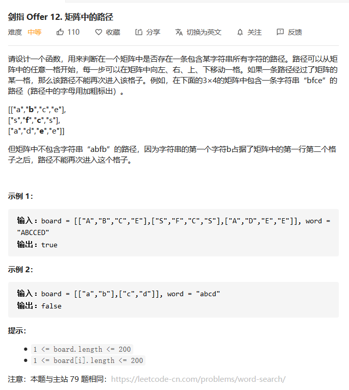

## 矩阵中的路径

> 剑指Offer 12：矩阵中的路径【中等题】



#### 方法：回溯

根据题目要求，需要我们从一个已知矩阵中找到一个可以挨个形成给定字符串的路径。如果有这条路径的话，我们需要返回```true```，如果没有的话，我们返回```false```，并且相同的字符不能重复使用。

从题目的解析上，我们可以很自然的联想到遍历整个矩阵，只是在遍历整个矩阵时，我们还需要保证每一次使用的元素不能重复，此时我们可以联想到**回溯算法**。

首先我们需要建立一个访问矩阵```vis```，遍历整个矩阵，找到字符串的第一个字符，这个位置将会被我们用来作为开始的位置。然后以此处为中心，开始向四周进行扩展遍历，查看扩展中的路径，能否有一条到达字符串最后字符的路径，如果有的话，我们便找到了我们需要的这个字符串路径。对于每次我们遍历过的字符，需要将其位置设为```true```，表示当前位置已经被访问过了，然后再继续遍历下一个字符，向下递归。

使用回溯算法的时候，我们需要弄清楚一个问题，什么时候开始回溯？如果当前矩阵字符和字符串字符不匹配，那我们可以直接结束遍历，返回```false```即可；只有在当前字符匹配成功，但是后续的字符匹配不成功的时候，我们才需要把已经匹配的字符的```vis```进行回溯。

**代码实现**

```java
	private boolean[][] vis;//存放访问过的节点
    private int row ;
    private int col ;

    public boolean exist(char[][] board, String word) {
        if(board == null || board.length == 0 || word == null) return false;
        row = board.length;
        col = board[0].length;
        vis = new boolean[row][col];
        for(int i = 0 ; i < row ; i ++){
            for(int j = 0 ; j < col ; j++){
                if(board[i][j] == word.charAt(0)){//寻找第一个符合的节点
                    boolean ans = help(board ,word , i , j , 0);
                    if(ans) return true;
                }
            }
        }
        return false;
    }
    private boolean help(char[][] board , String word , int x , int y , int index){
        if(index == word.length()) return true;//结束条件

        if(isOk(x,y) == false || board[x][y] != word.charAt(index)) return false;
        vis[x][y] = true;
        boolean ans =  help(board , word , x + 1 , y , index+1) || 
                        help(board , word , x - 1 , y , index+1) || 
                        help(board , word , x , y + 1 , index+1) || 
                        help(board , word , x , y - 1 , index+1);        
        
        if(ans) return true;
        vis[x][y] = false; //回溯
        return false;
    }
    private boolean isOk(int x,int y){//用于判断当前位置是否是合法位置
        if(x < 0 || x >= row || y < 0 || y >= col) return false;
        if(vis[x][y]) return false;
        return true;
    }
```

#### 【思考】

回溯算法在整个刷题系列里面出现的频次是非常高的。在我们后续刷题过程中，最主要的就是抓住两点，一个是回溯条件，还有一个就是结束条件，将这两个条件捋清楚之后，剩下的代码实现都是十分简洁的。

---

欢迎扫码关注本公众号哈~


