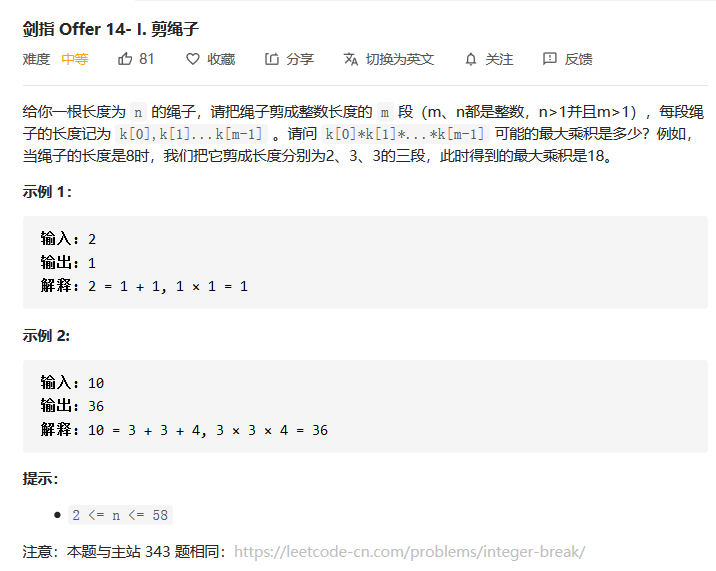
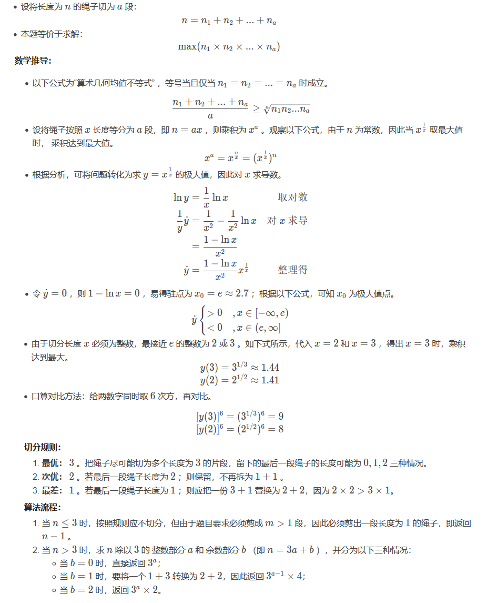

#### 剪绳子

> #### 剑指 Offer 14 I : 剪绳子【中等题】



#### 方法：贪心算法

在这道题中我们可以使用贪心算法，首先对题目进行分析，对于一段绳子```n```，可以拆分的方式有如下几种方式：

1. 拆分为```1```和```n-1```，此时两者的乘积为```1 * (n-1) < n```，这种拆法就很```low```了，越拆越小，还不如不拆，所以我们拆分方案中摒弃这种方法。
2. 拆分为```2```和```n-2```，这个时候是可以的，可以使结果更大一点
3. 拆分为```3```和```n-3```，这个时候也是可以的。
4. 拆分为```4```和```n-4```，这个时候结果相当于```2 * 2 * (n - 4)```，
5. 拆分为```5```和```n-5```，这个时候的结果并不大，对于5而言，我们可以将其分为```2```和```3```，最后的结果就是```2 * 3 > 5```。

所以综上可以看出，我们的整个拆分，优先以```3```和```2```为主，

下面有一个证明方法大家可以参考一下，来源于：

> https://leetcode-cn.com/problems/jian-sheng-zi-ii-lcof/solution/mian-shi-ti-14-ii-jian-sheng-zi-iitan-xin-er-fen-f/



如果小伙伴们不想看这个解题过程的话，直接记一下最后的结论吧！==我们优先将绳子拆分的优先级为：3,2,1==

**代码实现**

```java
public int cuttingRope(int n) {//应该优先将其分割为3的长度
    int res = 1;
    if(n == 2 )  return 1; 
    if(n == 3 )  return 2;
    while(n > 4){
        res *= 3;
        n -= 3; 
    }
    return res*n;
}
```

#### 【思考】

本题的解题思路主要就是利用一个贪心的方法，来逐个分析整体的思路。我们在上面给出了一位大佬的证明过程，还是蛮清晰的。当然也有一些比较暴力的方法，比如一些动态规划的做法，但是上面给出的这种以```k=3```为主的切分方案，是最直接高效的方法。

---

