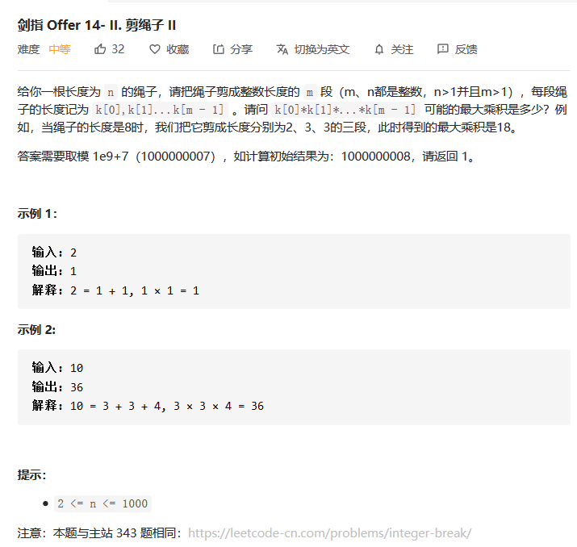
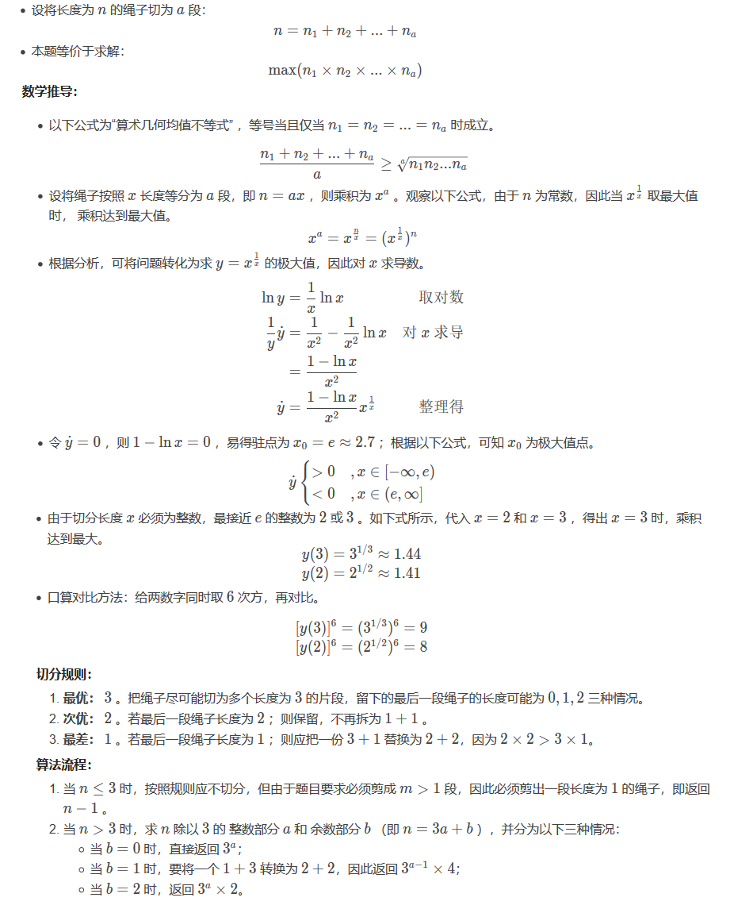

## 剪绳子II

> #### 剑指 Offer 14- II ： 剪绳子 II【中等题】



#### 解法：贪心/数学推导

此题与前面一道题（剪绳子I）极其相似，详情可见（[剪绳子I]()）。但是本题中，增加了许多更加复杂的用例，每次计算的结果都可能超过```long```类型的范围。所以前面那道题的许多解法，比如动态规划等解法，都无法使用当前的这种情况。

我们依旧给出前面那道题的结论：拆分的时候，优先拆出来的数字依次为：```3、2、1```，下面我们依旧给出这个数学推导的过程。（推导过程源自：https://leetcode-cn.com/problems/jian-sheng-zi-ii-lcof/solution/mian-shi-ti-14-ii-jian-sheng-zi-iitan-xin-er-fen-f/）



**代码实现：**

```java
    public int cuttingRope(int n) {
        if(n == 2) return 1;
        if(n == 3) return 2;
        int mod = 1000000007 ; 
        long res = 1;
        while(n > 4){
            res *= 3;
            res %= mod;
            n -= 3;
        }
        return (int)(res*n % mod);
    }
```

#### 【总结】

在使用一些基本的算法，比如动态规划时，我们还需要考虑接受数组的元素类型的范围，如果产生的结果范围超出了接受类型的操作范围，对于整个最后的结果会产生致命性的影响。

---

