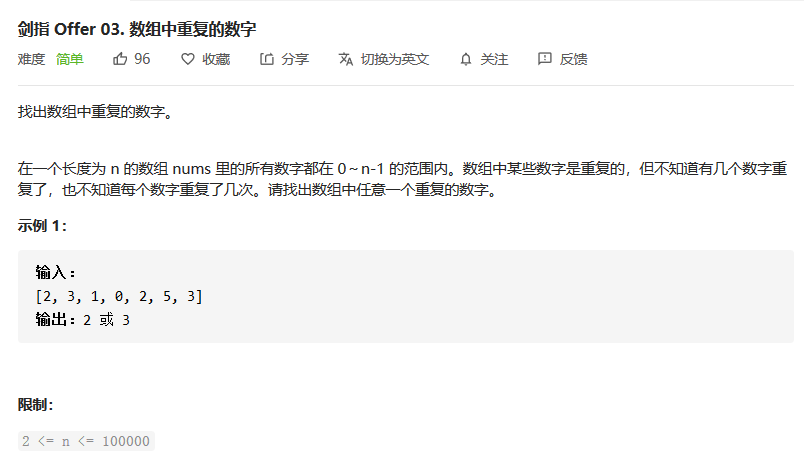

之前的刷题都是随心所欲的刷，没有按照什么章程来给各位小伙伴展现。本周开始，小白把LeetCode上面的《剑指offer》，逐一的进行分享吧~会在公众里面开一个专栏，有兴趣的小伙伴的可以在公众号里面查看的哈~每次分享的解法小白尽量选择简单易懂的解法，对于一些数学方法，咱们没必要考虑那么多，原因很简单**不实用**。

---

## 数组中重复的数字

> 剑指offer第1题：数组中复的数字【简单题】



#### 解法一：

题目中要求我们找出任意的一个重复数字，可以直接使用我们的set集合，具有天然的排重功能。直接向其中不断的添加元素即可。这样的查找还是比较简单的。

**代码实现：**

```java
    public int findRepeatNumber(int[] nums) {
        HashSet<Integer> set = new HashSet<>();
        for(int i = 0 ; i < nums.length ; i++){
            if(set.add(nums[i])) continue;
            return nums[i];
        }
        return 0;
    }
```

#### 解法二：

对于解法一而言，我们需要额外的开辟新的空间，所以相对而言空间复杂度较高。那么根据 题目条件，所有的数字都在0~n-1的范围之内，而整个数组的长度为n，所以我们可以将数组中的每个元素与数组的下标对应，使得每个元素与其下标的关系为：```nums[i] == i```，由于```nums```数组中有重复的数字，所以在排列过程中，必定会出现两次```nums[i] = i```，此时就可以断定```i```即为重复的数字，返回即可。

**代码实现**

```java
    public int findRepeatNumber(int[] nums) {
        int index;
        for(int i = 0 ; i < nums.length ; i++){
            while(nums[i] != i){//原地交换
                index = nums[i];
                if(nums[i] == nums[index]) return nums[i];
                nums[i] = nums[index];
                nums[index] = index;
            }
        }
        return -1;
    }
```

---

本周的题目分享就到这里吧，以后会将每道题目分开分享，当剑指offer系列全部更新结束以后，小白再从更高的角度来探寻每道题之间的联系。下周再见~see you！

