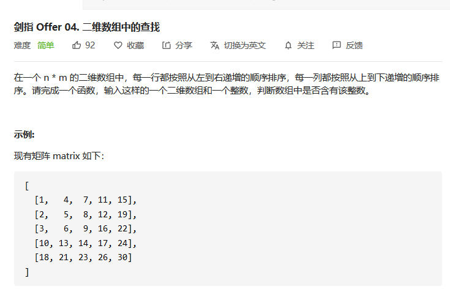
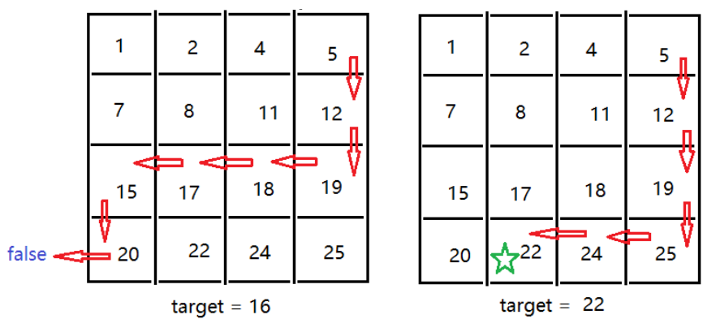

## 二维数组的查找

> 剑指offer第2题：二维数组查找



#### 解法一：

当前数组从上到下是升序，从左到右也是升序，所以我们可以选择一个合适的入口点，通过判断当前的值与```target```的大小比较，然后选择我们将要遍历的方向。这是一个比较好的思路。

所以在选择遍历的入口时，我们可以选择左下角和右上角开始。从这两个入口处开始遍历时，我们的每一次的位置，都属于每一行和每一列的最值，比如一行的最大值，一列的最小值。当我们处于最值情况时，这个时候做出的每一次判断，会更加精确，能够做到不重不漏，结合之前写的一篇文章的过程图：



下面就是我们自己实现的代码，从左下角开始运动的哈~

**代码实现：**

```java
class Solution {
    public boolean findNumberIn2DArray(int[][] matrix, int target) {
        if(matrix == null || matrix.length == 0) return false;
        int rows = matrix.length;
        int cols = matrix[0].length;
        int down = rows - 1;
        int left = 0;
        while(left < cols && down >=  0){//从左下角还是遍历
            if(matrix[down][left] > target){
                down--;
            }else if(matrix[down][left] < target){
                left++;
            }else{
                return true;
            }
        }
        return false;
    }
}
```

#### 解法二：

由于每一行和每一列都具有升序的特征，我们也可以使用两次二分法来完成操作。

第一次二分法，我们选择锁定一行，然后就变成了一个一维数组查找```target```的情况了，这时，我们可以再次使用二分法，完成下一次的探索，如果没有找到则返回```false```。

在进行二分法时需要**注意**一点：我们在进行第一个二分法时，如果```nums[mid] >  target```，此时我们应该进行的操作时将```left = mid```而不是```left = mid+1```。为什么这样呢？因为在第一次的二分法时，我们只是确定```target```所在的行数，如果```target```就在```mid```行，那么此时的```target```也是大于```nums[mid][0]```的。如果直接```left = mid+1```，则有可能错过```target```所在行。

**代码实现**

```java
class Solution {
    public boolean searchMatrix(int[][] matrix, int target) {
        if(matrix == null || matrix.length == 0 || matrix[0].length == 0) return false;
        int down = matrix.length - 1; //矩阵的行数
        int up = 0 ; 
        int right = matrix[0].length - 1 ; //矩阵的列数
        int left = 0;

        while(up < down ){//首先对行数进行锁定
            int midRow = up + (down - up) / 2 + 1;//由于up无法+1，所以我们需要在midRow这里+1
            if(matrix[midRow][0] == target){
                return true;
            }else if(matrix[midRow][0] > target){
                down = midRow - 1;
            }else{
                up = midRow ;//此时不能对up+1,因为此时的target可能就在这一行
            }
        }
        while(left < right){//锁定列
            int midCol = left + (right - left) / 2 ;
            if(matrix[up][midCol] == target){
                return true;
            }else if(matrix[up][midCol] > target){
                right = midCol;
            }else{
                left = midCol + 1;
            }
        }
        return matrix[up][left] == target ;
    }
}
```

