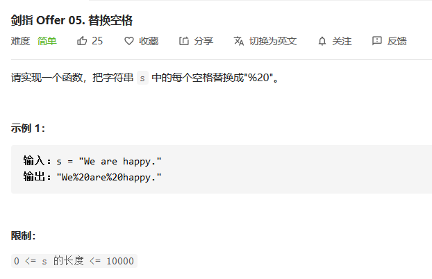

## 替换空格

> #### 剑指Offer05：替换空格【简单题】



#### 解法一：

直接遍历整个字符串，对于空格的地方，使用```%20```进行替换，对于其他部分我们依旧直接```append```就好。

【注意】在这道题中，可能有些小伙伴会想到使用```String.split(" ")```方法来分割字符串，但是会有意外发生。如果有连续的字符串存在，那么分割后的结果中，将会减少整体字符的数量。比如```"    "```，这是5个空格，当我们使用分割方法之后，我们将会得到一个长度为0的字符串数组，此时我们的将无法把```%20```插入进去。

**代码实现**

```java
public String replaceSpace(String s) {
    String replace = "%20";
    char[] ch = s.toCharArray();
    StringBuilder sb = new StringBuilder();
    for(char c : ch){
        sb.append(c == ' ' ? replace : c);
    }
    return sb.toString();
}
```

#### 解法二：

还有一种方法，我们可以使用jdk自带的```String.replace()```方法，直接一行代码搞定。这种方法看起来还是蛮可观的，时间和空间都是击败```100%```，但是这种方法小白并不推荐。我们还是回归刷题的本质来联系比较好，避免做```API工程师```。

**代码实现**

```java
public String replaceSpace(String s) {
    return s.replace(" " , "%20");
}
```


