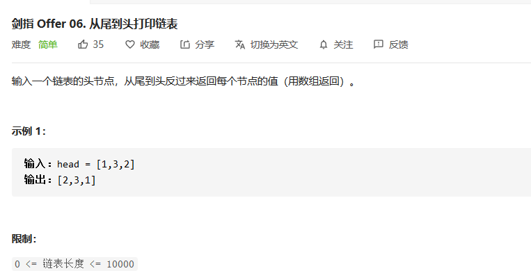

## 从尾到头打印链表

> #### 剑指Offer 06：从尾到头打印链表



#### 解法一：反转链表

题目要求我们从尾到头打印数组，首先应该想到我们肯定是需要对整个链表进行一个反序操作。所以联想到我们之前做过的反转链表题目，这道就解出来了。

我们可以借鉴反转链表的解题，然后将反转之后的链表再次遍历，然后将其存储到对应的数组中即可。

**代码实现**

```java
class Solution {
    public int[] reversePrint(ListNode head) {
        ListNode pre = null;
        int size = 0;//记录链表长度
        while(head != null){//反转链表
            ListNode temp = head.next;
            head.next = pre;
            pre = head;
            head = temp;
            size++;
        }
        int[] ans = new int[size];
        for(int i = 0 ; i < size ; i++){//构建返回数组
            ans[i] = pre.val;
            pre = pre.next;
        }
        return ans;
    }
}
```

#### 解法二：使用栈

当然，我们在做反转操作的时候，可以结合栈的数据结构特点。栈具有很明显的特点就是**后进先出**，自然的反序数据结构。所以我们可以在第一次遍历整个链表的时候，将链表中的每个元素直接```push```到```stack```中，然后再重新将所有栈中所有元素```pop```出来，即可完成整个链表的反序输出。

**代码实现**

```java
	public int[] reversePrint(ListNode head) {
        Stack<Integer> stack = new Stack<>();
        while(head != null){
            stack.push(head.val);
            head = head.next;
        }
        int size = stack.size();
        int[] ans = new int[size];
        for(int i = 0 ; i < size ; i++){
            ans[i] = stack.pop();
        }
        return ans;
    }
```

