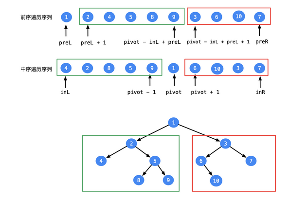

## 重建二叉树

> 剑指offer 07：重建二叉树


#### 解决思路

这道题要求我们根据**中序遍历和前序遍历**构建一颗二叉树。在前序遍历中，遍历顺序为```根节点-->左节点-->右节点```，中序遍历顺序为```左节点-->根节点-->右节点```，所以我们按照前序遍历的顺序进行遍历的时候，都可以将整个中序遍历序列分为左右子树，然后依次将左右孩子规划为根节点下面即可。小白在评论区里逛到一位同学画的流程图，小白就不自己画啦！[链接在这里](https://leetcode-cn.com/problems/zhong-jian-er-cha-shu-lcof/solution/er-cha-shu-de-qian-xu-bian-li-fen-zhi-si-xiang-by-/)。



根据这张流程图，我们可以对其进行实现。

在实现过程中，我们一般的套路是先将中序遍历使用```map```进行一个抽象，这样便于我们后面每次获取当前根节点在中序遍历中的索引位置，然后我们即可将中序遍历分为两个部分，分别构建左右子树节点。

**代码实现**

```java
    HashMap<Integer,Integer> map = new HashMap<>();
    int preIndex = 0;//遍历前序遍历的索引值
    public TreeNode buildTree(int[] preorder, int[] inorder) {
        for(int i = 0 ; i < inorder.length ; i++){//首先抽象出中序遍历
            map.put(inorder[i] , i);
        }
        return help(preorder , inorder , 0 , preorder.length - 1);
    }

    private TreeNode help(int[] preorder , int[] inorder , int start , int end){
        if(start > end) return null;
        int val = preorder[preIndex++];//获取头结点
        TreeNode node = new TreeNode(val);
        int midIndex = map.get(val);
        node.left = help(preorder , inorder , start , midIndex - 1);//构建左节点
        node.right = help(preorder , inorder , midIndex+1 , end);//构建右节点
        return node;
    }
```


---

觉得不错的话，关注一波呀~

