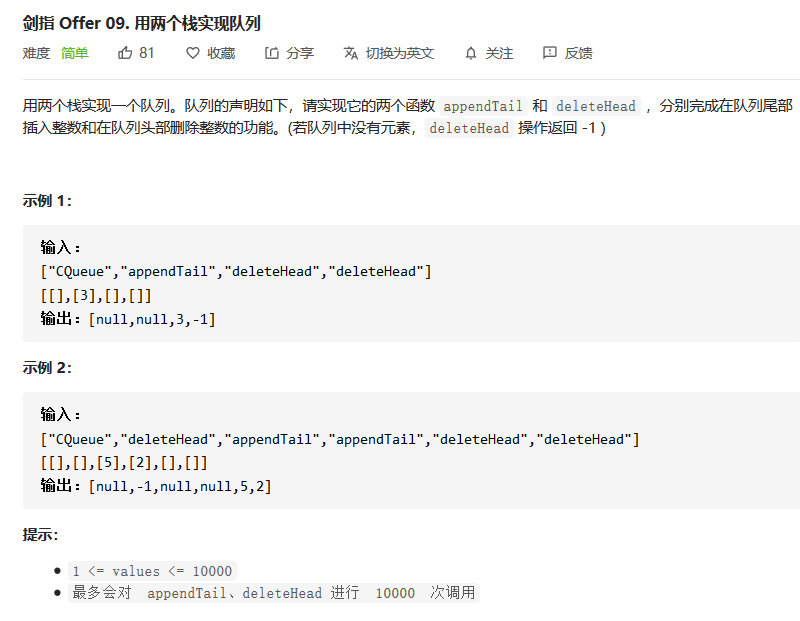

## 用两个栈实现队列

> 剑指Offer 09:用两个栈实现队列




#### 解法：

对于这种数据结构的实现类题目，出题者的意图主要还是想让我们对这种数据结构具有深刻的了解。对于栈而言，具有先进后出的特点，而对于队列而言，具有先进先出的特点。所以根据这些特点我们来分析此题。

栈的特点是先进后出，当我们对栈进行两次```push```和```pop```的操作之后，那么第二次```push```之后的顺序就是对比第一次的顺序就是先进先出的顺序了。利用两个栈，主要的目的就是让我们**倒腾两次**，让先进的元素最后放在栈顶，后进的元素放在栈底。

所以我们可以设置两个栈，第一个栈主要用来```push```数据，所有先进来的元素都会被放在栈底。当我们需要获取头元素的时候，我们先从第一个栈中把所有的元素都```pop```到第二个栈中。这样我们的第二个栈就恢复到了初始```push```值的顺序了。我们直接从第二个栈中```pop```出栈顶元素，即为第一次加入到队列中的元素。

**代码实现：**

```java
    Stack<Integer> stack1;
    Stack<Integer> stack2;

    public CQueue() {
        stack1 = new Stack<>();
        stack2 = new Stack<>();
    }
    
    public void appendTail(int value) {
        stack1.push(value);
    }
    
    public int deleteHead() {
        if(stack2.size()!=0) return stack2.pop();//优先从stack2中弹出值
        while(stack1.size()!=0){//将stack1中的值全部压入到stack2中，保证stack2中的弹出顺序是stack1中的压入顺序
            stack2.push(stack1.pop());
        }
        return stack2.size() == 0 ? -1 : stack2.pop();
    }
```


【注意】顺便提一句，这道题虽然很简单，但是在小白```一面百度```的时候，面试官最后一道题就是这道题，没有让小白手撕代码，直接说思路即可。所以希望看到这篇文章的小伙伴能够好好理解一下这道题目的思路。


#### 【拓展】

在这道题中，还是让我们熟悉队列与栈的特点。在LeetCode上面的第225题是使用两个队列来完成一个栈的功能。有兴趣的小伙伴儿可以看一下！链接在下面哈~

>  https://leetcode-cn.com/problems/implement-stack-using-queues/


---

欢迎扫码关注呀~


