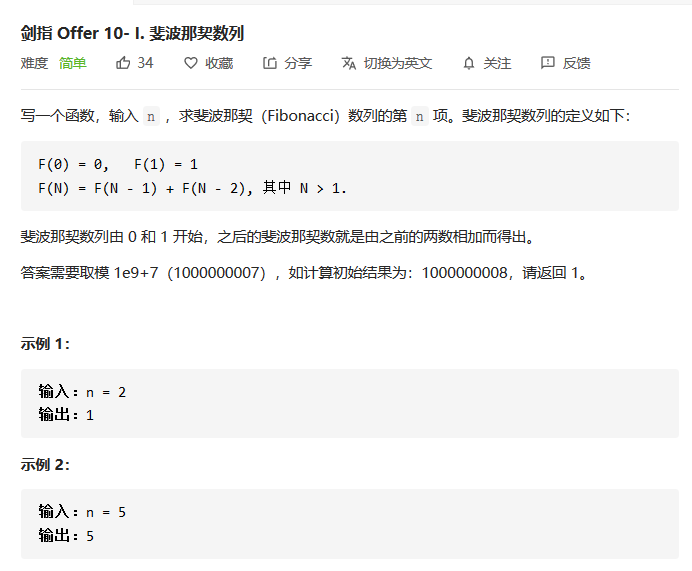

## 斐波拉契数列

> 剑指Offer 10- I ： 斐波那契数列【简单题】



#### 解决方法：

对于斐波拉契数列的使用，我们只需要知道通项公式，然后依次从第一项一直推导到第```n```项即可。根据题目中给出的通项公式

> ```
> F(0) = 0,   F(1) = 1
> F(N) = F(N - 1) + F(N - 2), 其中 N > 1.
> ```

在我们使用斐波拉契数列的时候，我们可以使用一个数组来存放每一项的值。在此题中，仅仅要求我们给出第```n```项的值，而且在斐波拉契数列中，计算第```n```项值的时候，仅仅需要前两项的值，所以我们可以仅仅使用两个值来代替```f(n-1)```和```f(n-2)```即可，如下面的代码实现中那样。

**代码实现**

```java
    public int fib(int n) {
        int pre = 0;
        if(n < 1) return pre;
        int cur = 1;
        if(n == 1 || n == 2) return cur;
        for(int i = 2 ; i <= n ;i++){
            int temp = pre + cur;
            pre = cur;
            cur = temp;
            cur = cur % 1000000007 ;
        }
        return cur;
    }

```

#### 【思考】

《剑指offer》属于程序员必刷的数据结构书籍，所以剑指offer中的每一道题可谓是精华中的精华，为什么会从千万题海中选择一个简单的斐波拉契数列放在这本名书中呢？其中应该还是有很值得探索的地方。

如果我们仅仅从斐波拉契数列本身而看，这道题很显然是一道简单题。但是其背后的思路还是很值得我们研究的。

对比其他的题目：对一个数组或者容器进行遍历，然后求所需值。对于一些遍历容器数组中的题目而言，我们所遍历的容器其实是一个固定的内容。而斐波拉契数列有一个很重要的特点：**数列中的每个元素都相互存在联系**，每一个元素并非是简单的堆放在一起就完事儿了。

对于这些相互存在联系的元素而言，如果想要完整的描述整个序列。那么我们使用数学语言寻找到递推公式，类比到这里，递推公式就是```F(N) = F(N - 1) + F(N - 2)```，然后依次考虑边界问题。**而这个正是我们在使用动态规划时的解题思路**。

在我们使用动态规划的方法来解决类似问题时，我们的首要想法也依旧是**从简单的两项或者三项互相推导开始**，然后从边界条件与结束条件来考虑整道题的开始与结束。

所以作者把斐波拉契数列放在《剑指offer》中，更多的应该是为后续的动态规划做一个铺垫，让我们逐渐有这种推导元素间依赖关系的思维。小白认为，这可能才是一道简单题放在《剑指offer》中的意义所在吧！

---

欢迎扫码关注！

