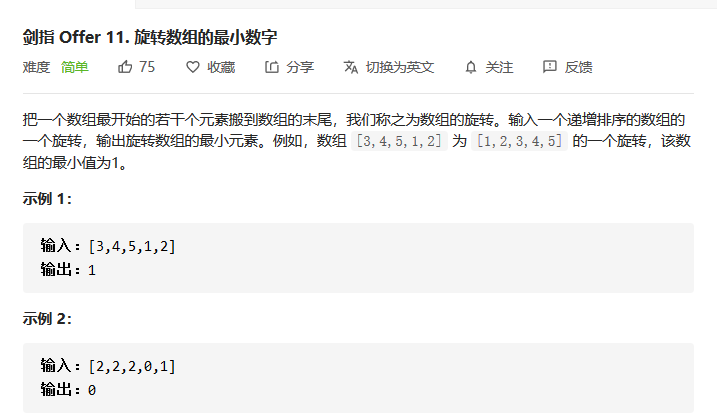

## 旋转数组的最小数字

> 剑指Offer 11：旋转数组的最小数字【简单题】



#### 方法一：顺序遍历

题目首先给我们一个排序的数组，然后将其分为两半，把后面的数组分为两半之后，对这两半进行旋转。然后让我们找到旋转数组的最小值，即未旋转之前的数组的第一个值。

由于旋转之后的数组仅仅是按照某一个位置开始旋转，所以最后的旋转数组也可以分为两部分，并且每一个部分都是符合升序排序的。然而在旋转点，这两个数组就是一个断崖式下跌，然后再重新开始升序排列。所以我们就可以利用这个“断崖式下跌”，来寻找原始数组中的第一个值，这个下跌的点即为整个数组的最小值。

然后我们开始分析一下特殊情况。假如给我们的旋转数组是在第0号位置进行旋转，那么我们将无法寻找到“断崖式”下跌的旋转点，所以，如果我们在遍历完整个数组都依旧没有找打这个旋转点时，就可以证明这个旋转数组并没有进行旋转，此时的数组第一个值即为最小值，直接返回即可。

**代码实现**

```java
public int minArray(int[] numbers) {
    for(int i = 0 ; i < numbers.length - 1 ; i++){
        if(numbers[i] <= numbers[i+1]) continue;
        return numbers[i+1];
    }
    return numbers[0];
}
```

#### 方法二：二分法

我们把这个数组分为两部分，前半部分```part1```和后半部分```part2```，其中```part1```中的每个部分都大于```part2```，所以我们可以使用二分法，通过查看```mid```的值与右节点```right```的比较，来判断当前```mid```在何处。当```mid > right```时，```mid```只能在```part1```，当```mid < right```的时候，```mid```只能处于```part2```中。

【注意】我们在比较的时候，不要和```left```作比较。因为当```mid < left```，我们可以判断出来，```mid```在``part2``，并且```left```在```part1```，但是当```mid > left```时，可能```left``` 和```mid```均处于```part1```，也有可能```left```恰好处于最小值处，则此时```mid```与```left```都处于```part2```，在这种情况下，我们无法选择正确的收缩边界的条件。

**代码实现**

```java
    public int minArray(int[] numbers) {
        int left = 0 , right = numbers.length - 1;
        if(numbers[left] < numbers[right]) return numbers[left];
        while(left < right){
            int mid = left + (right - left)/2;
            if(numbers[mid] < numbers[right]){//当前值在右侧
                right = mid;
            }else if(numbers[mid] > numbers[right]) left = mid + 1;//mid在左侧
            else right--; //无法判断
        }
        return numbers[left];
    }
```


#### 【思考】

对于本题而言，方法二中的二分法显然是更加优质的一种解法。二分法的关键在于每次将中间值```mid```与目标值```target```进行比较，使得我们能够判定当前的```mid```值处于整个序列的何处。所以在比较的时候，```target```的选择十分重要。我们在比较完```mid```与```target```的相对关系之后，我们应该可以得到一个很明确的相对位置关系，所以我们选择```target```需要深思熟虑，类比到本题中，如果选择```left```，则会出现某些情况下的歧义性，导致我们无法根据```mid```与```left```比较关系来精准定位```mid```，这将会对我们的整体判断十分不利，而选择```right```作为```target```，则可以在每一种相对大小的情况下，都得到一种非歧义的精准位置，这才是我们想要的。

所以我们在使用二分法的时候，一定尽可能的多的考虑每种比较情况背后发生的可能的结果。这样我们的二分法才会具有良好的效果。

与此同时，我们的二分法在使用过程中，有一个隐含的条件，就是整体的序列或数组需要是一个**有序集合**，不一定是单调序列，但是一定是一个我们可以掌握的顺序。如果不满足这个条件，那么我们将无法使用二分法。

---

欢迎扫码关注本公众号哈~


